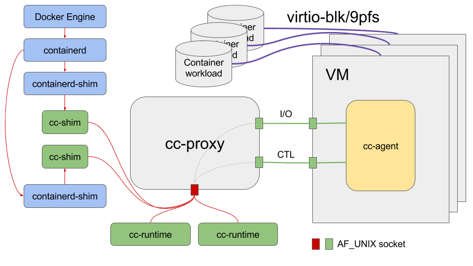
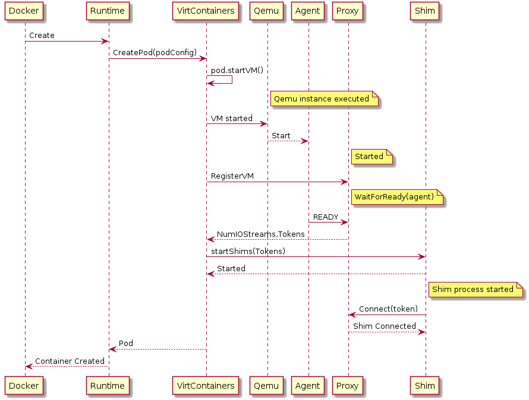
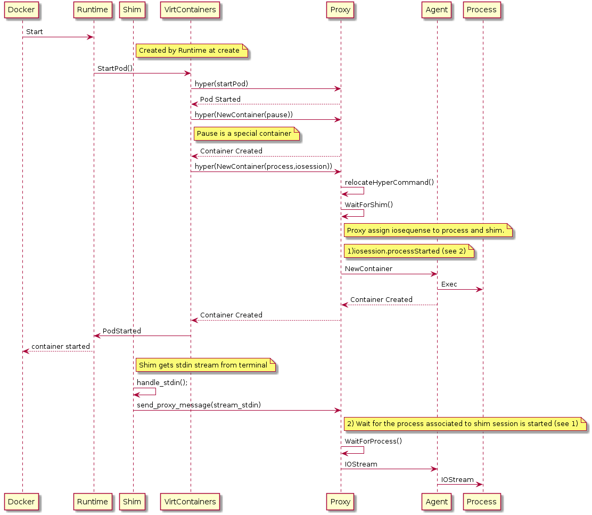
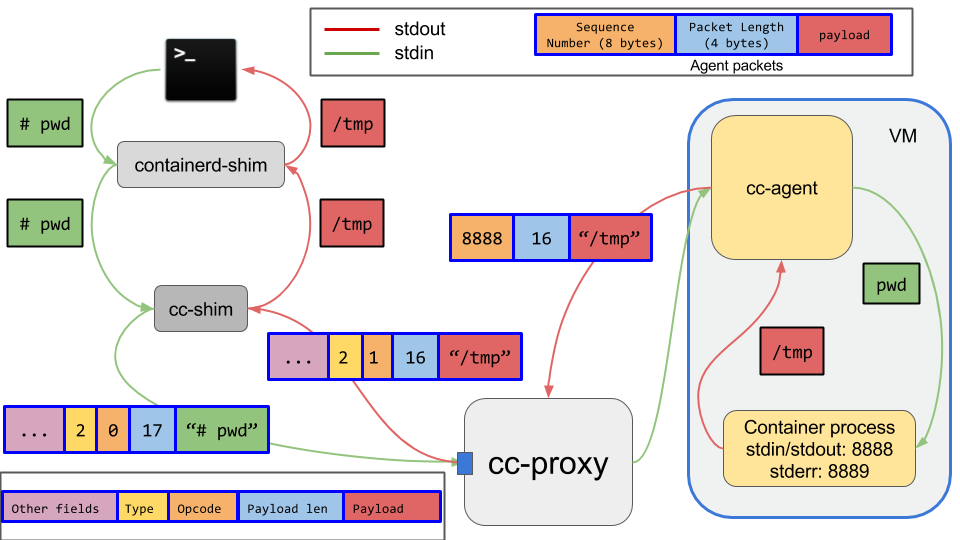

# Clear Containers Architecture

* [Overview](#overview)
    * [Hypervisor](#hypervisor)
      * [Assets](#assets)
        * [Guest kernel](#guest-kernel)
        * [Root filesystem image](#root-filesystem-image)
    * [Agent](#agent)
    * [Runtime](#runtime)
        * [Configuration](#configuration)
        * [Significant commands](#significant-commands)
            * [create](#create)
            * [start](#start)
            * [exec](#exec)
            * [kill](#kill)
            * [delete](#delete)
    * [Proxy](#proxy)
    * [Shim](#shim)
    * [Networking](#networking)
    * [Storage](#storage)
    * [Kubernetes Support](#kubernetes-support)
        * [Problem Statement](#problem-statemem)
        * [OCI Annotations](#oci-annotations)
        * [Generalization](#generalization)
        * [Mixing VM based and namespace based runtimes](#mixing-vm-based-and-namespace-based-runtimes)
* [Appendices](#appendices)
    * [DAX](#dax)
    * [Previous Releases](#previous-releases)
    * [Resources](#resources)

## Overview

This is an architectural overview of Clear Containers, based on the 3.0 release.

The [Clear Containers runtime (cc-runtime)](https://github.com/clearcontainers/runtime)
is compatible with the [OCI](https://github.com/opencontainers) [runtime specification](https://github.com/opencontainers/runtime-spec)
and therefore works seamlessly with the
[Docker\* Engine](https://www.docker.com/products/docker-engine) pluggable runtime
architecture. It also supports the [Kubernetes\* Container Runtime Interface (CRI)](https://github.com/kubernetes/kubernetes/tree/master/pkg/kubelet/apis/cri/v1alpha1/runtime)
through the [CRI-O\*](https://github.com/kubernetes-incubator/cri-o) implementation.
In other words, you can transparently select between the
[default Docker and CRI-O runtime (runc)](https://github.com/opencontainers/runc)
and `cc-runtime`.


`cc-runtime` creates a QEMU\*/KVM virtual machine for each container or pod
the Docker engine or Kubernetes' `kubelet` creates.

The container process is then spawned by an
[agent](https://github.com/clearcontainers/agent) running as a daemon inside
the virtual machine. The agent opens two virtio serial interfaces (Control and
I/O) in the guest, and QEMU exposes them as serial devices on the host. `cc-runtime`
uses the control device for sending container management commands to the agent
while the I/O serial device is used to pass I/O streams (`stdout`, `stderr`,
`stdin`) between the guest and the Docker Engine.

For any given container, both the init process and all potentially executed
commands within that container, together with their related I/O streams, need
to go through two virtio serial interfaces exported by QEMU. A [Clear Containers
proxy (`cc-proxy`)](https://github.com/clearcontainers/proxy) instance is
launched for each virtual machine to handle multiplexing and demultiplexing
those commands and streams.

On the host, each container process's removal is handled by a reaper in the higher
layers of the container stack. In the case of Docker it is handled by `containerd-shim`.
In the case of CRI-O it is handled by `conmon`. For clarity, for the remainder
of this document the term "container process reaper" will be used to refer to
either reaper. As Clear Containers processes run inside their own  virtual machines,
the container process reaper can not monitor, control
or reap them. `cc-runtime` fixes that issue by creating an [additional shim process
(`cc-shim`)](https://github.com/clearcontainers/shim) between the container process
reaper and `cc-proxy`. A `cc-shim` instance will both forward signals and `stdin`
streams to the container process on the guest and pass the container `stdout`
and `stderr` streams back up the stack to CRI-O or Docker via the container process
reaper. `cc-runtime` creates a `cc-shim` daemon for each container and for each
OCI command received to run within an already running container (example, `docker
exec`).

The container workload, that is, the actual OCI bundle rootfs, is exported from the
host to the virtual machine.  In the case where a block-based graph driver is
configured, virtio-blk will be used. In all other cases a 9pfs virtio mount point
will be used. `cc-agent` uses this mount point as the root filesystem for the
container processes.



## Hypervisor

Clear Containers use [QEMU](http://www.qemu-project.org/)/[KVM](http://www.linux-kvm.org/page/Main_Page)
to create virtual machines where containers will run:


Although Clear Containers can run with any recent QEMU release, Clear Containers
boot time and memory footprint are significantly optimized by using a specific QEMU
version called [`qemu-lite`](https://github.com/01org/qemu-lite/tree/qemu-2.7-lite).

Clear Containers supports various machine types, including `pc`, `pc-lite` and `q35`.
Clear Containers defaults to using the `pc` machine type. In the past
`pc-lite` was utilized which provided the following improvements:
- Removed many of the legacy hardware devices support so that the guest kernel
  does not waste time initializing devices of no use for containers.
- Skipped the guest BIOS/firmware and jumped straight to the Clear Containers
  kernel.

In order to provide some advanced features which were lacking in `pc-lite` like hotplug
support, the default was changed to `pc`.

In the future, Clear Containers plan to move to a 2.9 based version of QEMU,
available at 
the [Clear Containers QEMU repository](https://github.com/clearcontainers/qemu/tree/qemu-lite-v2.9.0).
This transition has been delayed until after the release of Clear Containers 3.0
due to regressions, as described in [runtime issue 407](https://github.com/clearcontainers/runtime/issues/407).
Once support for features like hotplug are available in `q35`, the project will
look to transition to this machine type.

### Assets

Additional resources are required to create each QEMU virtual machine
instance, specifically a guest kernel and a root filesystem image known as the
"mini O/S".

The locations of these resources are passed to
QEMU by the runtime (see [Configuration](#configuration)).

#### Guest kernel

The guest kernel is passed to the QEMU hypervisor and used to boot the virtual
machine. It is highly optimised for kernel boot time and minimal memory
footprint, providing only those services required by a container workload.

#### Root filesystem image

The root filesystem image, sometimes referred to as the "mini O/S", is a
highly optimised container bootstrap system based on [Clear Linux](https://clearlinux.org/).
It provides an extremely minimal environment and has a highly optimised boot
path.

The only services running in the context of the mini O/S are the init daemon
(`systemd`) and the [Agent](#agent). The real workload the user wishes to run
executes within a confined context which uses the container manager image as
its root filesystem.

For example, when `docker run -ti ubuntu date` is run:

- The hypervisor will boot the mini-OS image using the guest kernel.
- `systemd`, running inside the mini-OS context, will launch the `cc-agent` in
  the same context.
- The agent will create a new confined context to run the specified command in
  (`date` in this example).
- The agent will then execute the command (`date` in this example) inside this
  new context, first setting the root filesystem to the expected Ubuntu* root
  filesystem.

## Agent

[`cc-agent`](https://github.com/clearcontainers/agent) is a daemon running in the
guest as a supervisor for managing containers and processes running within
those containers.

The `cc-agent` execution unit is the pod. A `cc-agent` pod is a container sandbox
defined by a set of namespaces (NS, UTS, IPC and PID). `cc-runtime` can run several
containers per pod to support container engines that require multiple containers
running inside a single VM. In the case of docker, `cc-runtime` creates a single
container per pod.

`cc-agent` uses a communication protocol defined by the [hyperstart](https://github.com/hyperhq/hyperstart)
project. This was chosen to maintain backward compatibility with the `hyperstart`
agent used in the 2.x `Clear Containers` architecture.

The `cc-agent` interface consists of:
- A control serial channel over which the `cc-agent` sends and receives specific
  commands for controlling and managing pods and containers. Detailed information
  about the commands can be found at [`cc-agent` API](https://github.com/clearcontainers/agent/tree/master/api).
- An I/O serial channel for passing the container processes output streams (`stdout`,
  `stderr`) back to `cc-proxy` and receiving the input stream (`stdin`) for them. As
  all streams for all containers are going through one single serial channel, the
  `cc-agent` prepends them with container specific sequence numbers. There are
  at most two sequence numbers per container process: one for `stdout` and `stdin`,
  and another one for `stderr`.

`cc-agent` supports the following commands:
- `StartPodCmd`: Sets up a pod in a newly created VM. 
- `NewContainerCmd`: Creates a new container within a pod. This needs to be sent
  after the `StartPodCmd` has been issued for starting a pod. This command also
  starts the container process.
- `ExecCmd`: Executes a new process within an already running container.
- `KillContainerCmd`: `cc-shim` uses this to send signals to a container process.
- `WinsizeCmd`: `cc-shim` uses this to change the terminal size of the terminal
  associated with a container.
- `RemoveContainerCmd`: Removes a container from the pod. This command will fail
  if the container is in a running state.
- `Destroypod`: Removes all containers within a pod . All containers need to be
  in a stopped state for this command to succeed. The command also frees resources
  associated with the pod.

Each control message is composed of a command code and a payload required for
the command:

```
  ┌────────────────┬────────────────┬──────────────────────────────┐
  │  Command Code  │     Length     │ Payload(request or response) │
  │   (32 bits)    │    (32 bits)   │     (data length bytes)      │
  └────────────────┴────────────────┴──────────────────────────────┘
```
- `Command Code` is the predefined id associated with a command.
- `Length` is the size of the entire message in bytes and encoded in network order.
- `Payload` is the JSON-encoded command request or response data.

Each stream message is composed of a stream sequence code and a payload containing
the stream data.

```
  ┌────────────────┬────────────────┬──────────────────────────────┐
  │  Sequence Code │     Length     │          Payload             │
  │   (64 bits)    │    (64 bits)   │     (data length bytes)      │
  └────────────────┴────────────────┴──────────────────────────────┘
```
- `Sequence code` is the 64 bit sequence number assigned by `cc-agent` for a stream.
- `Length` is the size of the entire stream message in bytes and encoded in network
  order.
- `Payload` is the stream data.

The `cc-agent` makes use of [`libcontainer`](https://github.com/opencontainers/runc/tree/master/libcontainer)
to manage the lifecycle of the container. This way the `cc-agent` reuses most
of the code used by [`runc`](https://github.com/opencontainers/runc).

## Runtime

`cc-runtime` is an OCI compatible container runtime and is responsible for handling
all commands specified by
[the OCI runtime specification](https://github.com/opencontainers/runtime-spec)
and launching `cc-shim` instances.

`cc-runtime` heavily utilizes the
[virtcontainers project](https://github.com/containers/virtcontainers), which
provides a generic, runtime-specification agnostic, hardware-virtualized containers
library.

### Configuration

The runtime uses a TOML format configuration file called `configuration.toml`. By
default this file is installed in the `/usr/share/defaults/clear-containers`
directory and contains various settings such as the paths to the hypervisor,
the guest kernel and the mini-OS image.

Most users will not need to modify the configuration file.

The file is well commented and provides a few "knobs" that can be used to modify
the behavior of the runtime.

The configuration file is also used to enable runtime debug output (see
https://github.com/clearcontainers/runtime#debugging).

### Significant OCI commands

Here we will describe how `cc-runtime` handles the most important OCI commands.

#### [`create`](https://github.com/clearcontainers/runtime/blob/master/create.go)

When handling the OCI `create` command, `cc-runtime` goes through the following steps:

1. Create the networking container namespace on the host, according to the container
  OCI configuration file. We only support networking namespaces for now, but
  will support other namespaces later.
2. Run all the [prestart OCI hooks](https://github.com/opencontainers/runtime-spec/blob/master/config.md#hooks)
  in the host namespaces created in step 1, as described by the OCI container
  configuration file.
3. [Set up the container networking namespace](#networking). This is when
  all networking interfaces are created and setup inside the namespace, according
  to the selected pod networking model (CNM for Docker or CNI for Kubernetes).
4. Create and start the virtual machine that will run the container process. The
  VM will run inside the host namespaces created during step 1, and its `systemd`
  instance will spawn the `cc-agent` daemon.
5. Spawn the `cc-proxy` process providing a single argument:
  `cc-proxy --uri $(uri)`
   * A UNIX socket URI, used by the `cc-shim` and `cc-agent` processes is used to pass information between them.
6. Register the virtual machine with `cc-proxy`.
7. The `cc-proxy` waits for the agent to signal that it is ready and then returns
  a token. This token uniquely identifies a process within a container inside
  the virtual machine.
8. Spawn the `cc-shim` process providing two arguments:
  `cc-shim --token $(token) --uri $(uri)`
   * The proxy URI, which can be either a UNIX or a TCP socket.
   * The token for the container process it needs to monitor.
9. The `cc-shim` connects to the proxy and signals which container process it
  is going to monitor by passing its token through the `cc-proxy` `connectShim`
  command.



At this point, the virtual machine that will run the containers workloads
is up and running, and the [`cc-agent`](#agent) is ready to process container
life cycle commands. The pod inside the virtual machine is not created, and
the containers are not running yet. This will be done through the OCI 
[`start`](#start) command

#### [`start`](https://github.com/clearcontainers/runtime/blob/master/start.go)

With namespace containers, `start` launches a traditional Linux container process
in its own set of namespaces. With Clear Containers, the main task of `cc-runtime`
is to ask the [`cc-agent`](#agent) to create a pod inside the virtual machine
and then start all containers within this pod.
In practice, this means `cc-runtime` will run through the following steps:

1. `cc-runtime` connects to `cc-proxy` and sends it the `attach` command to
  let it know which VM we want to use to create a pod and start the new container.
2. `cc-runtime` sends an agent `STARTPOD` command via `cc-proxy`. This creates
  the container pod.
3. `cc-runtime` sends an agent `NEWCONTAINER` command via `cc-proxy` in order to
  create and start a new container in a given pod. The command is sent to `cc-proxy`
  which forwards it to the right agent instance running in the appropriate guest.



#### [`exec`](https://github.com/clearcontainers/runtime/blob/master/exec.go)

OCI `exec` allows you to run an additional command within an already running
container. With Clear Containers, this translates into sending a `EXECCMD` command
to the agent so that it executes a command into a running container belonging to a
certain pod. All I/O streams from the executed command will be passed back to
`containerd` or `conmon` through a newly created `cc-shim`.

The `exec` code path is partly similar to the `create` one and `cc-runtime`
goes through the following steps:

1. `cc-runtime` connects to `cc-proxy` and sends it the `attach` command to let
  it know which VM to run the `exec` command.
2. `cc-runtime` receives a token from `cc-proxy` based on this connection.
3. `cc-runtime` spawns a `cc-shim` process providing two arguments:
  `cc-shim --token $(token) --uri $(uri)`
   * The proxy URI, which can be either a UNIX or a TCP socket.
   * The token for the container process it needs to monitor.
  The `cc-shim` process will forward the output streams (`stderr` and `stdout`)
  to either `containerd-shim` in the Docker use cases or `conmon` for the Kubernetes
  deployements.
4. `cc-runtime` sends an agent `EXECMD` command to start the command in the
  container. The command is sent to `cc-proxy`, which forwards it to the
  agent instance running in the guest.

Now the `exec`'ed process is running in the virtual machine, sharing the UTS,
PID, mount and IPC namespaces with the container's init process.

#### [`kill`](https://github.com/clearcontainers/runtime/blob/master/kill.go)

When sending the OCI `kill` command, container runtimes should send a [UNIX signal](https://en.wikipedia.org/wiki/Unix_signal)
to the container process.
In the Clear Containers context, this means `cc-runtime` needs to handle 2 resources:

1. It needs to send the signal to the container running on the VM.
2. It needs to signal the [`shim`](#shim) since we don't want to leave dangling
  `cc-shim` instances on the host in case the container process terminates inside
  the VM.

To do so, `cc-runtime` goes through the following steps:

1. `cc-runtime` connects to `cc-proxy` and sends it the `attach` command to let
  it know on which VM the container it is trying to `kill` is running.
2. `cc-runtime` sends an agent `KILLCONTAINER` command to `kill` the container
  running on the guest. The command is sent to `cc-proxy` who forwards it to the
  agent instance running in the guest.

After step #2, if the container process terminates in the VM, `cc-proxy` will
forward the process exit code to the `shim`. The `shim` will then disconnect
from `cc-proxy` and terminates as well.

One corner case `cc-runtime` also needs to handle is when it receives a signal
for a container that's not yet running. In that case, for `SIGTERM` or `SIGKILL`
signals, `cc-runtime` will kill the `cc-shim`.  All other signals are ignored.


#### [`delete`](https://github.com/clearcontainers/runtime/blob/master/delete.go)

`delete` is about deleting all resources held by a stopped/killed container.
Running containers can not be deleted unless the OCI runtime is explicitly being
asked to. In that case it will first `kill` the container and only then `delete`
it.

The `delete` code path differs significantly between having to delete one container
inside a pod (as is typical in Docker) and having to delete an entire pod (such as
from Kubernetes). In the former case, `cc-runtime` will only send a
`SIGKILL` signal to the container process.  In the latter case, all components
are deleted: the pod, its containers, all `cc-shim` instances and the virtual
machine itself. 

Below we will focus on describing the entire pod deletion process and we will
look at the generic, multi-containers pod setup. Docker is just a particular case
for single container pods.

1. `cc-runtime` connects to `cc-proxy` and sends it the `attach` command to let
  it know on which pod the container it is trying to to `delete` is running.
2. `cc-runtime` terminates all container processes within a pod by sending the
  `KILLCONTAINER` command to all of them.
3. As each container process termination will be forwarded to all associated `cc-shim`
  instances, `cc-runtime` waits for all of them to terminate as well.
4. `cc-runtime` sends the `UnregisterVM` command to `cc-proxy`, to let it know
  that the virtual machine that used to host the pod should no longer be used.
5. The `cc-proxy` instance exits.
6. `cc-runtime` shuts down the virtual machine.
7. The host namespaces are cleaned up and destroyed. In particular, `cc-runtime`
  offloads the networking namespace cleanup path by calling into the specific
  networking model (CNM or CNI) removal method.
8. All remaining pod-related resources on the host are deleted.

## Proxy

`cc-proxy` is a daemon offering access to the VM [`cc-agent`](https://github.com/clearcontainers/agent)
to multiple `cc-shim` and `cc-runtime` clients associated with the VM. Its
main role is to route the I/O streams and signals between each `cc-shim`
instance and the `cc-agent`.

The `cc-proxy` API is available through a socket for the `cc-shim` and
`cc-runtime` instances to connect to. `cc-proxy` can be configured to use a UNIX
or a TCP socket, and by default will handle connection over a UNIX socket.

The protocol on the `cc-proxy` socket supports the following commands:
- `RegisterVM`: Used by `cc-runtime` to let `cc-proxy` know about a newly created
  virtual machine. When registering a new VM, `cc-runtime` will ask `cc-proxy`
  for a token and pass that token to the `cc-shim` instance it will eventually
  create for handling the container process inside that VM.
- `UnregisterVM`: Does the opposite of what `RegisterVM` does, indicating to
  the proxy it should release resources created by `RegisterVM` and then exit
  itself.
- `AttachVM`: It can be used to associate clients to an already known VM.
  Optionally `AttachVM` senders can ask `cc-proxy` for a token. In the OCI `exec`
  command case, this token will be used by the `cc-shim` instance that monitors
  the executed process inside the container.
- `Hyper`: This payload will forward a hyperstart command to the `cc-agent`.
- `ConnectShim`: Used by `cc-shim` instances to connect to `cc-proxy` and let
  it know which container process it wants to monitor. `cc-shim` sends the token
  they've been given by `cc-runtime` as part of the `ConnectShim` payload. With
  that information, `cc-proxy` builds its I/O and signal multiplexing routes
  between the VM process containers and the host `cc-shim` instances.
- `DisconnectShim`: Used by `cc-shim` instances to disconnect themselves from
  `cc-proxy` and let it know that they stop monitoring their container process.

For more details about `cc-proxy`'s protocol, theory of operations or debugging
tips, please read the
[`cc-proxy` README](https://github.com/clearcontainers/proxy) or the
[proxy api `godoc`](https://godoc.org/github.com/clearcontainers/proxy/api).

## Shim

A container process reaper, such as Docker's `containerd-shim` or CRI-O's `conmon`,
is designed around the assumption that it can monitor and reap the actual container
process. As the container process reaper runs on the host, it cannot directly
monitor a process running within a virtual machine. At most it can see the QEMU
process, but that is not enough. With Clear Containers, `cc-shim` acts as the
container process that the container process reaper can monitor. Therefore
`cc-shim` needs to handle all container I/O streams (`stdout`, `stdin` and `stderr`)
and forward all signals the container process reaper decides to send to the container
process.

`cc-shim` has an implicit knowledge about which VM agent will handle those streams
and signals and thus acts as an encapsulation layer between the container process
reaper and the `cc-agent`. `cc-shim`:

- Connects to `cc-proxy` using a token obtained by calling the `cc-proxy` `ConnectShim`
  command. The token is passed from `cc-runtime` to `cc-shim` when the former
  spawns the latter and is used to identify the true container process that the
  shim process will be shadowing or representing.
- Fragments and encapsulates the standard input stream from the container process
  reaper into `cc-proxy` stream frames:
```
                  1 1 1 1 1 1 1 1 1 1 2 2 2 2 2 2 2 2 2 2 3 3
0 1 2 3 4 5 7 8 9 0 1 2 3 4 5 6 7 8 9 0 1 2 3 4 5 6 7 8 9 0 1
┌───────────────────────────┬───────────────┬───────────────┐
│          Version          │ Header Length │   Reserved    │
├───────────────────────────┼─────┬─┬───────┼───────────────┤
│          Reserved         │ Res.│E│  0x2  │    Opcode     │
├───────────────────────────┴─────┴─┴───────┴───────────────┤
│                      Payload Length                       │
├───────────────────────────────────────────────────────────┤
│                                                           │
│                         Payload                           │
│                                                           │
│      (variable length, optional and opcode-specific)      │
│                                                           │
└───────────────────────────────────────────────────────────┘
```
- De-encapsulates and assembles standard output and error `cc-proxy` stream frames
  into an output stream that it forwards to the container process reaper.
- Translates all UNIX signals (except `SIGKILL` and `SIGSTOP`) into `cc-proxy`
  `Signal` frames that it sends to the container via `cc-proxy`.

As an example, assuming that running the `pwd` command from a containers standard
input will generate the output "`/tmp`" on the containers standard output. If the
`cc-agent` assigned to this process uses sequence number 8888 for `stdin` and `stdout`
and 8889 for `stderr`, with `cc-shim` and Clear Containers, this example would look
like:



## Networking

Containers will typically live in their own, possibly shared, networking namespace.
At some point in a container lifecycle, container engines will set up that namespace
to add the container to a network which is isolated from the host network, but
which is shared between containers

In order to do so, container engines will usually add one end of a `virtual ethernet
(veth)` pair into the container networking namespace. The other end of the `veth`
pair
is added to the container network.

This is a very namespace-centric approach as QEMU can not handle `veth` interfaces.
Instead it typically creates `TAP` interfaces for adding connectivity to a virtual
machine.

To overcome that incompatibility between typical container engines expectations
and virtual machines, `cc-runtime` networking transparently bridges `veth`
interfaces with `TAP` ones:


Clear Containers supports both
[CNM](https://github.com/docker/libnetwork/blob/master/docs/design.md#the-container-network-model)
and [CNI](https://github.com/containernetworking/cni) for networking management.

### CNM


__CNM lifecycle__

1.  RequestPool

2.  CreateNetwork

3.  RequestAddress

4.  CreateEndPoint

5.  CreateContainer

6.  Create `config.json`

7.  Create PID and network namespace

8.  ProcessExternalKey

9.  JoinEndPoint

10. LaunchContainer

11. Launch

12. Run container


__Runtime network setup with CNM__

1. Read `config.json`

2. Create the network namespace

3. Call the prestart hook (from inside the netns)

4. Scan network interfaces inside netns and get the name of the interface
  created by prestart hook

5. Create bridge, TAP, and link all together with network interface previously
  created

### CNI


__Runtime network setup with CNI__

1. Create the network namespace.

2. Get CNI plugin information.

3. Start the plugin (providing previously created network namespace) to add a network
  described into `/etc/cni/net.d/ directory`. At that time, the CNI plugin will
  create the `cni0` network interface and a veth pair between the host and the created
  netns. It links `cni0` to the veth pair before to exit.

4. Create network bridge, TAP, and link all together with network interface previously
  created.

5. Start VM inside the netns and start the container.

## Storage
Container workloads are shared with the virtualized environment through [9pfs](https://www.kernel.org/doc/Documentation/filesystems/9p.txt).
The devicemapper storage driver is a special case. The driver uses dedicated block
devices rather than formatted filesystems, and operates at the block level rather than the file
level. This knowledge is used to directly use the underlying block device
instead of the overlay file system for the container root file system. The block
device maps to the top read-write layer for the overlay. This approach gives much
better I/O performance compared to using 9pfs to share the container file system.

The approach above does introduce a limitation in terms of dynamic file copy
in/out of the container using the `docker cp` operations. The copy operation from
host to container accesses the mounted file system on the host-side. This is
not expected to work and may lead to inconsistencies as the block device will
be simultaneously written to from two different mounts. The copy operation from
container to host will work, provided the user calls `sync(1)` from within the
container prior to the copy to make sure any outstanding cached data is written
to the block device.

```
docker cp [OPTIONS] CONTAINER:SRC_PATH HOST:DEST_PATH
docker cp [OPTIONS] HOST:SRC_PATH CONTAINER:DEST_PATH
```

Clear Containers has the ability to hotplug and remove block devices, which makes it
possible to use block devices for containers started after the VM has been launched.

Users can check to see if the container uses the devicemapper block device as its
rootfs by calling `mount(8)` within the counter.  If the devicemapper block device
is used, `/` will be mounted on `/dev/vda`.  Users can disable direct mounting
of the underlying block device through the runtime configuration.

## Kubernetes support

[Kubernetes\*](https://github.com/kubernetes/kubernetes/) is a popular open source
container orchestration engine. In Kubernetes, a set of containers sharing resources
such as networking, storage, mount, PID, etc. is called a
[Pod](https://kubernetes.io/docs/user-guide/pods/).
A node can have multiple pods, but at a minimum, a node within a Kubernetes cluster
only needs to run a container runtime and a container agent (called a
[kubelet](https://kubernetes.io/docs/admin/kubelet/)).

A Kubernetes cluster runs a control plane where a scheduler (typically running on a
dedicated master node) calls into a compute kubelet. This kubelet instance is
responsible for managing the lifecycle of pods within the nodes and eventually relies
on a container runtime to handle execution. The kubelet architecture decouples
lifecycle management from container execution through the dedicated
[`gRPC`](https://github.com/kubernetes/kubernetes/blob/master/pkg/kubelet/apis/cri/v1alpha1/runtime/api.proto) 
based [Container Runtime Interface (CRI)](https://github.com/kubernetes/community/blob/master/contributors/design-proposals/node/container-runtime-interface-v1.md).

In other words, a kubelet is a CRI client and expects a CRI implementation to
handle the server side of the interface.
[CRI-O\*](https://github.com/kubernetes-incubator/cri-o) is a CRI implementation
that relies on [OCI](https://github.com/opencontainers/runtime-spec) compatible
runtimes for managing container instances.

Clear Containers is an officially supported CRI-O runtime. It is OCI compatible and
therefore aligns with CRI-O architecture and requirements.
However, due to the fact that Kubernetes execution units are sets of containers (also
known as pods) rather than single containers, the Clear Containers runtime needs to
get extra information to seamlessly integrate with Kubernetes.

### Problem statement

The Kubernetes\* execution unit is a pod that has specifications detailing constraints
such as namespaces, groups, hardware resources, security contents, *etc* shared by all
the containers within that pod.
By default the kubelet will send a container creation request to its CRI runtime for
each pod and container creation. Without additional metadata from the CRI runtime,
the Clear Containers runtime will thus create one virtual machine for each pod and for
each containers within a pod. However the task of providing the Kubernetes pod semantics
when creating one virtual machine for each container within the same pod is complex given
the resources of these virtual machines (such as networking or PID) need to be shared.

The challenge with Clear Containers when working as a Kubernetes\* runtime is thus to know
when to create a full virtual machine (for pods) and when to create a new container inside
a previously created virtual machine. In both cases it will get called with very similar
arguments, so it needs the help of the Kubernetes CRI runtime to be able to distinguish a
pod creation request from a container one.

### OCI annotations

In order for the Clear Containers runtime (or any virtual machine  based OCI compatible
runtime) to be able to understand if it needs to create a full virtual machine or if it
has to create a new container inside an existing pod's virtual machine, CRI-O adds
specific annotations to the OCI configuration file (`config.json`) which is passed to
the OCI compatible runtime.

Before calling its runtime, CRI-O will always add a `io.kubernetes.cri-o.ContainerType`
annotation to the `config.json` configuration file it produces from the kubelet CRI
request. The `io.kubernetes.cri-o.ContainerType` annotation can either be set to `sandbox`
or `container`. Clear Containers will then use this annotation to decide if it needs to
respectively create a virtual machine or a container inside a virtual machine associated
with a Kubernetes pod:

```Go
	containerType, err := ociSpec.ContainerType()
	if err != nil {
		return err
	}

	switch containerType {
	case vc.PodSandbox:
		process, err = createPod(ociSpec, runtimeConfig, containerID, bundlePath, console, disableOutput)
		if err != nil {
			return err
		}
	case vc.PodContainer:
		process, err = createContainer(ociSpec, containerID, bundlePath, console, disableOutput)
		if err != nil {
			return err
		}
	}

```

### Generalization

Clear Containers 2.1, implemented the initial Kubernetes / CRI-O support by choosing
to handle pods as a special case for containers. By default the runtime would only be aware
of containers and only when receiving CRI-O specific annotations would it follow specific
code paths to handle pods and intra pod containers. This approach showed that container
orchestration support was an afterthought with 2.1, and that supporting the single container
Docker use case was the main focus.

Starting from the 3.0 release, Clear Containers took a different, almost opposite, approach.
The Clear Containers 3.0 runtime is based on the `virtcontainers` package whose API is
inspired by the Kubernetes CRI one. `virtcontainers` execution units are pods and it does
not create or manage any container outside of an existing pod context, and thus so does the
Clear Container 3.0 runtime.
To create a Docker container it will first create a pod which will represent the container
hardware virtualized context and then start an actual container inside that virtual machine.
Both the pod and its container have the same identifier and name.

### Mixing VM based and namespace based runtimes

One interesting evolution of the CRI-O support for the Clear Containers runtime is the ability
to run virtual machine based pods alongside namespace ones. With CRI-O and Clear Containers,
one can introduce the concept of workload trust inside a Kubernetes cluster.

A cluster operator can now tag (through Kubernetes annotations) container workloads as `trusted`
or `untrusted`. The former labels known to be safe workloads while the latter describes
potentially malicious or misbehaving workloads that need the highest degree of isolation.
In a software development context, an example of a `trusted` workload would be a containerized
continuous integration engine whereas all developers applications would be `untrusted` by default.
Developers workloads can be buggy, unstable or even include malicious code and thus from a
security perspective it makes sense to tag them as `untrusted`. A CRI-O and Clear Containers
based Kubernetes cluster handles this use case transparently as long as the deployed containers
are properly tagged. All `untrusted` containers will be handled by Clear Containers and thus run
in a hardware virtualized secure sandbox whilst `runc`, for example, could  handle the
`trusted` ones.

CRI-O's default behaviour is to trust all pods, except when they're annotated with
`io.kubernetes.cri-o.TrustedSandbox` set to `false`. The default CRI-O trust level is
set through its `configuration.toml` configuration file. Generally speaking, the CRI-O
runtime selection between its trusted runtime (typically `runc`) and its untrusted one
(Clear Containers) is a function of the pod `Privileged` setting, the `io.kubernetes.cri-o.TrustedSandbox`
annotation value, and the default CRI-O trust level. When a pod is `Privileged`, the
runtime will always be `runc`. However, when a pod is **not** `Privileged` the runtime
selection is done as follows:

|                                        | `io.kubernetes.cri-o.TrustedSandbox` not set   | `io.kubernetes.cri-o.TrustedSandbox` = `true` | `io.kubernetes.cri-o.TrustedSandbox` = `false` |
| :---                                   |     :---:                                      |     :---:                                     |     :---:                                             |
| Default CRI-O trust level: `trusted`   | runc                                           | runc                                          | Clear Containers |
| Default CRI-O trust level: `untrusted` | Clear Containers                               | Clear Containers                              | Clear Containers |

# Appendices

## DAX

Clear Containers utilises the Linux kernel DAX [(Direct Access filesystem)](https://git.kernel.org/cgit/linux/kernel/git/torvalds/linux.git/tree/Documentation/filesystems/dax.txt)
feature to efficiently map some host-side files into the guest VM space.
In particular, Clear Containers uses the QEMU nvdimm feature to provide a
memory-mapped virtual device that can be used to DAX map the virtual machine's
root filesystem into the guest memory address space.

Mapping files using DAX provides a number of benefits over more traditional VM
file and device mapping mechanisms:

- Mapping as a direct access devices allows the guest to directly access
  the host memory pages (such as via eXicute In Place (XIP)), bypassing the guest
  page cache. This provides both time and space optimisations.
- Mapping as a direct access device inside the VM allows pages from the
  host to be demand loaded using page faults, rather than having to make requests
  via a virtualised device (causing expensive VM exits/hypercalls), thus providing
a speed optimisation.
- Utilising `MAP_SHARED` shared memory on the host allows the host to efficiently
  share pages.

Clear Containers uses the following steps to set up the DAX mappings:
1. QEMU is configured with an nvdimm memory device, with a memory file
  backend to map in the host-side file into the virtual nvdimm space.
2. The guest kernel command line mounts this nvdimm device with the DAX
  feature enabled, allowing direct page mapping and access, thus bypassing the
  guest page cache.


Information on the use of nvdimm via QEMU is available in the [QEMU source code](http://git.qemu-project.org/?p=qemu.git;a=blob;f=docs/nvdimm.txt;hb=HEAD)

## Previous Releases

This section provides a brief overview of architectural features enabled in
prior and current versions of Clear Containers.

### Version 3.0

- Moved from hyperstart to `cc-agent` as an agent inside the VM.
- Moved from `qemu-lite` to `pc` QEMU machine type.
- Rewrite of runtime in go, leveraging virtcontainers.
- New simplified protocol between `cc-shim`, `cc-proxy` and `cc-runtime`.
- KSM throttling.
- `virtio-blk` for block based graph drivers.

### Version 2.2

Summary:

- Support for devicemapper storage.

Further details:

- https://github.com/01org/cc-oci-runtime/releases/tag/2.2.0

### Version 2.1

Summary:

- Introduction of `hyperstart` as an agent inside the VM.
- Creation of `cc-shim` and `cc-proxy`.  Major features this enables:
  - Collection of workload exit codes (`cc-shim`)
  - Full support for terminal/signal control (`cc-proxy`)

Further details:

- https://github.com/01org/cc-oci-runtime/releases/tag/2.1.0

### Version 2.0

Summary:

- Clear Containers V2.0 is OCI compatible, and integrates seamlessly into
  Docker 1.12 via the OCI runtime method.
- Moved from `lkvm/kvmtool` to QEMU for more extended functionality.
- Used nvdimm to DAX map host files into the guest.

Code:

- https://github.com/01org/cc-oci-runtime/releases/tag/2.0.0

### Version 1.0

Summary:

- Initial instantiation of Clear Containers.
- Using `lkvm/kvmtool` as VM supervisor on the host.
- Not OCI compatible - 1.0 is a compiled replacement runtime for Docker (an
  "execution d  river") and required a different build of docker to be installed
  on the host system.
- Utilised a virtual PCI device to DAX map host files into the guest.

Code:

- https://github.com/clearlinux-pkgs/clear-containers-docker

## Resources

The 2.x architecture document is available at:

- https://github.com/01org/cc-oci-runtime/blob/master/documentation/architecture.md
