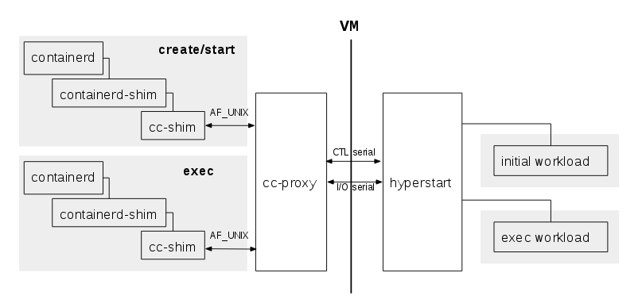

# `cc-proxy`

`cc-proxy` is a daemon offering access to the
[`hyperstart`](https://github.com/hyperhq/hyperstart) VM agent to multiple
clients. Only a single instance of `cc-proxy` per host is necessary as it can be
used for several different VMs.



- The `hyperstart` interface consists of:
    - A control channel on which the [`hyperstart` API]
      (https://github.com/hyperhq/runv/tree/master/hyperstart/api/json) is
      delivered.
    - An I/O channel with the stdin/stout/stderr streams of the processes
      running inside the VM multiplexed onto.
- `cc-proxy`'s main role is to:
    - Arbitrate access to the `hyperstart` control channel between all the
      instances of the OCI runtimes and `cc-shim`.
    - Route the I/O streams between the various shim instances and `hyperstart`.
 

`cc-proxy` itself has an API to setup the route to the hypervisor/hyperstart
and to forward `hyperstart` commands. This API is done with a small JSON RPC
protocol on an `AF_UNIX` located at: `${localstatesdir}/run/cc-oci-runtime/proxy.sock`

## Protocol

The proxy protocol is composed of messages: requests and responses. These form
a small RPC protocol, requests being similar to a function call and responses
encoding the result of the call.

Each message is composed of a header and some optional data:

```
  ┌────────────────┬────────────────┬──────────────────────────────┐
  │  Data Length   │    Reserved    │  Data (request or response)  │
  │   (32 bits)    │    (32 bits)   │     (data length bytes)      │
  └────────────────┴────────────────┴──────────────────────────────┘
```

- `Data Length` is in bytes and encoded in network order.
- `Reserved` is reserved for future use.
- `Data` is the JSON-encoded request or response data

On top of of this request/response mechanism, the proxy defines `payloads`,
which are effectively the various function calls defined in the API.

Requests have 2 fields: the payload `id` (function name) and its `data`
(function argument(s))

```
type Request struct {
	Id    string          `json:"id"`
	Data *json.RawMessage `json:"data,omitempty"`
}
```

Responses have 3 fields: `success`, `error` and `data`

```
type Response struct {
	Success bool                   `json:"success"`
	Error   string                 `json:"error,omitempty"`
	Data    map[string]interface{} `json:"data,omitempty"`
}
```

Unsurprisingly, the response has the result of a command, with `success`
indicating if the request has succeeded for not. If `success` is `true`, the
response can carry additional return values in `data`. If success if `false`,
`error` will contain an error string suitable for reporting the error to a
user.

As a concrete example, here is an exchange between a client and the proxy:

```
{ "id": "hello", "data": { "containerId": "foo", "ctlSerial": "/tmp/sh.hyper.channel.0.sock", "ioSerial": "/tmp/sh.hyper.channel.1.sock"  } }
{"success":true}
```

- The client starts by calling the `hello` payload, registered the container
  `foo` and asking the proxy to connect to hyperstart communication channels
  given
- The proxy answers the function call has succeeded

## Payloads

Payloads are in their own package and [documented there](
https://godoc.org/github.com/01org/cc-oci-runtime/proxy/api)

## `systemd` integration

When compiling in the presence of the systemd pkg-config file, two systemd unit
files are created and installed.

  - `cc-proxy.service`: the usual service unit file
  - `cc-proxy.socket`: the socket activation unit

The proxy doesn't have to run all the time, just when a Clear Container is
running. Socket activation can be used to start the proxy when a client
connects to the socket for the first time.

After having run `make install`, socket action is enabled with:

```
sudo systemctl enable cc-proxy.socket
```

The proxy can output log messages on stderr, which are automatically
handled by systemd and can be viewed with:

```
journalctl -u cc-proxy -f
```

## SELinux

To verify you have SELinux enforced check the output of `sestatus`:

```
$ sestatus 
SELinux status:                 enabled
SELinuxfs mount:                /sys/fs/selinux
SELinux root directory:         /etc/selinux
Loaded policy name:             targeted
Current mode:                   enforcing
Mode from config file:          error (Permission denied)
Policy MLS status:              enabled
Policy deny_unknown status:     allowed
Max kernel policy version:      30
```

If you have `SELinux status enabled` and `Current mode enforcing`, then you'll 
need to build and install SELinux `cc-proxy` policy.

Run the following commands as root:

```
cd selinux/
dnf install selinux-policy-devel rpm-build
make 
restorecon -R -v /run/cc-oci-runtime/proxy.sock
semodule -X 300 -i cc-proxy.pp.bz2
systemctl start cc-proxy.socket
```

Detailed info in `selinux/README.md`

## Debugging

`cc-proxy` uses [glog](https://github.com/golang/glog) for its log messages.

`glog` can be configured through command line parameters, try the `-h` option
for more details. Contrary to the `glog` defaults, `cc-proxy` defaults to
writing log messages to stderr .

```
$ sudo ./cc-proxy -v 2
```

Additionally, the `CC_PROXY_LOG_LEVEL` environment variable can be used to set
the log level. The command line parameter `-v` takes precedence over the
environment variable.

```
$ sudo CC_PROXY_LOG_LEVEL=1 ./cc-proxy
```

There are 3 verbosity levels:

  - Level 1 will show the important events happening at the proxy interfaces
  - Level 2 will dump the raw data going over the I/O channel
  - Level 3 will display the VM console logs. With clear VM images, this will
    show hyperstart's stdout and stderr.
