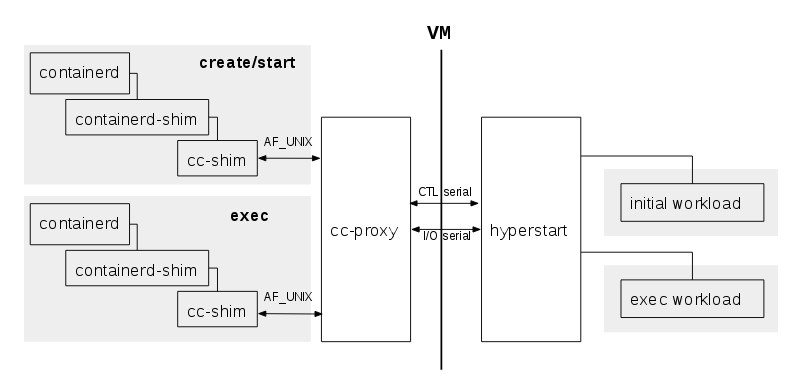

[](https://travis-ci.org/clearcontainers/proxy)
[](https://goreportcard.com/report/github.com/clearcontainers/proxy)
[](https://coveralls.io/github/clearcontainers/proxy?branch=master)
[](https://godoc.org/github.com/clearcontainers/proxy/api)


# `cc-proxy`

`cc-proxy` works alongside the [Clear Containers runtime](
https://github.com/clearcontainers/runtime) and [shim](
https://github.com/clearcontainers/shim) to provide a VM-based [OCI runtime](
https://www.opencontainers.org/) solution.

`cc-proxy` is a daemon offering access to the [`hyperstart`](
https://github.com/hyperhq/hyperstart) VM agent to both the runtime and shim
processes. Only a single instance of `cc-proxy` per host is necessary as it can
be used for several different VMs.



- The `hyperstart` interface consists of:
    - A control channel on which the [`hyperstart` API](
      https://github.com/hyperhq/runv/tree/master/hyperstart/api/json) is
      delivered.
    - An I/O channel with the stdin/stout/stderr streams of the processes
      running inside the VM multiplexed onto.
- `cc-proxy`'s main role is to:
    - Arbitrate access to the `hyperstart` control channel between all the
      instances of the OCI runtimes and `cc-shim`.
    - Route the I/O streams between the various shim instances and `hyperstart`.
 

`cc-proxy` itself has an API to setup the route to the hypervisor/hyperstart
and to forward `hyperstart` commands. This API is done with a small JSON RPC
protocol on an `AF_UNIX` located at: `${localstatesdir}/run/cc-oci-runtime/proxy.sock`

## Protocol

 the protocol interacts with the proxy is described in the [documentation of
 the `api` package](https://godoc.org/github.com/clearcontainers/proxy/api).


## `systemd` integration

When compiling in the presence of the systemd pkg-config file, two systemd unit
files are created and installed.

  - `cc-proxy.service`: the usual service unit file
  - `cc-proxy.socket`: the socket activation unit

The proxy doesn't have to run all the time, just when a Clear Container is
running. Socket activation can be used to start the proxy when a client
connects to the socket for the first time.

After having run `make install`, socket action is enabled with:

```
sudo systemctl enable cc-proxy.socket
```

The proxy can output log messages on stderr, which are automatically
handled by systemd and can be viewed with:

```
journalctl -u cc-proxy -f
```

## SELinux

To verify you have SELinux enforced check the output of `sestatus`:

```
$ sestatus 
SELinux status:                 enabled
SELinuxfs mount:                /sys/fs/selinux
SELinux root directory:         /etc/selinux
Loaded policy name:             targeted
Current mode:                   enforcing
Mode from config file:          error (Permission denied)
Policy MLS status:              enabled
Policy deny_unknown status:     allowed
Max kernel policy version:      30
```

If you have `SELinux status enabled` and `Current mode enforcing`, then you'll 
need to build and install SELinux `cc-proxy` policy.

Run the following commands as root:

```
cd selinux/
dnf install selinux-policy-devel rpm-build
make 
restorecon -R -v /run/cc-oci-runtime/proxy.sock
semodule -X 300 -i cc-proxy.pp.bz2
systemctl start cc-proxy.socket
```

Detailed info in `selinux/README.md`

## Debugging

`cc-proxy` uses [logrus](https://github.com/Sirupsen/logrus) for its log
 messages.

Logging verbosity can be configured through the `-log` command line
 parameter, try the `-h` option for more details.

```
$ sudo ./cc-proxy --log info
```

Additionally, the `CC_PROXY_LOG_LEVEL` environment variable can be used to set
the log level. The command line parameter `-v` takes precedence over the
environment variable.

```
$ sudo CC_PROXY_LOG_LEVEL=debug ./cc-proxy
```

The log level defines how verbose logging will be:

  - Level "info" will show the important events happening at the proxy
   interface and during the lifetime of a pod.
  - Level "debug" will dump the raw data going over the I/O channel and
   display the VM console logs. With clear VM images, this will show
   hyperstart's stdout and stderr.
