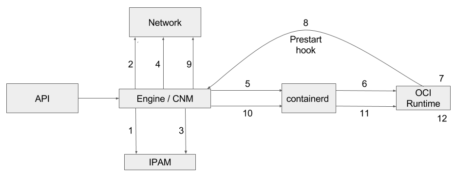

[](https://travis-ci.org/containers/virtcontainers)
[](https://semaphoreci.com/clearcontainers/virtcontainers)
[](https://goreportcard.com/report/github.com/containers/virtcontainers)
[](https://coveralls.io/github/containers/virtcontainers?branch=master)
[](https://godoc.org/github.com/containers/virtcontainers)

# virtcontainers

`virtcontainers` is a Go library that can be used to build hardware-virtualized container
runtimes.

## Background

The few existing VM-based container runtimes (Clear Containers, runv, rkt's
kvm stage 1) all share the same hardware virtualization semantics but use different
code bases to implement them. `virtcontainers`'s goal is to factorize this code into
a common Go library.

Ideally, VM-based container runtime implementations would become translation
layers from the runtime specification they implement (e.g. the [OCI runtime-spec][oci]
or the [Kubernetes CRI][cri]) to the `virtcontainers` API.

[oci]: https://github.com/opencontainers/runtime-spec
[cri]: https://github.com/kubernetes/kubernetes/blob/master/docs/proposals/container-runtime-interface-v1.md

## Out of scope

Implementing a container runtime tool is out of scope for this project. Any
tools or executables in this repository are only provided for demonstration or
testing purposes.

### virtcontainers and CRI

`virtcontainers`'s API is loosely inspired by the Kubernetes [CRI][cri] because
we believe it provides the right level of abstractions for containerized pods.
However, despite the API similarities between the two projects, the goal of
`virtcontainers` is _not_ to build a CRI implementation, but instead to provide a
generic, runtime-specification agnostic, hardware-virtualized containers
library that other projects could leverage to implement CRI themselves.

## Design

### Pods

The `virtcontainers` execution unit is a _pod_, i.e. `virtcontainers` users start pods where
containers will be running.

`virtcontainers` creates a pod by starting a virtual machine and setting the pod
up within that environment. Starting a pod means launching all containers with
the VM pod runtime environment.

### Hypervisors

The `virtcontainers` package relies on hypervisors to start and stop virtual machine where
pods will be running. An hypervisor is defined by an Hypervisor interface implementation,
and the default implementation is the QEMU one.

### Agents

During the lifecycle of a container, the runtime running on the host needs to interact with
the virtual machine guest OS in order to start new commands to be executed as part of a given
container workload, set new networking routes or interfaces, fetch a container standard or
error output, and so on.
There are many existing and potential solutions to resolve that problem and `virtcontainers` abstracts
this through the Agent interface.

## API

The high level `virtcontainers` API is the following one:

### Pod API

* `CreatePod(podConfig PodConfig)` creates a Pod.
The virtual machine is started and the Pod is prepared.

* `DeletePod(podID string)` deletes a Pod.
The virtual machine is shut down and all information related to the Pod are removed.
The function will fail if the Pod is running. In that case `StopPod()` has to be called first.

* `StartPod(podID string)` starts an already created Pod.
The Pod and all its containers are started.

* `RunPod(podConfig PodConfig)` creates and starts a Pod.
This performs `CreatePod()` + `StartPod()`.

* `StopPod(podID string)` stops an already running Pod.
The Pod and all its containers are stopped.

* `StatusPod(podID string)` returns a detailed Pod status.

* `ListPod()` lists all Pods on the host.
It returns a detailed status for every Pod.

### Container API

* `CreateContainer(podID string, containerConfig ContainerConfig)` creates a Container on an existing Pod.

* `DeleteContainer(podID, containerID string)` deletes a Container from a Pod.
If the Container is running it has to be stopped first.

* `StartContainer(podID, containerID string)` starts an already created Container.
The Pod has to be running.

* `StopContainer(podID, containerID string)` stops an already running Container.

* `EnterContainer(podID, containerID string, cmd Cmd)` enters an already running Container and runs a given command.

* `StatusContainer(podID, containerID string)` returns a detailed Container status.


An example tool using the `virtcontainers` API is provided in the `hack/virtc` package.

## Networking

Virtcontainers implements two different way of setting up pod's network:

### CNM



__CNM lifecycle__

1.  RequestPool

2.  CreateNetwork

3.  RequestAddress

4.  CreateEndPoint

5.  CreateContainer

6.  Create config.json

7.  Create PID and network namespace

8.  ProcessExternalKey

9.  JoinEndPoint

10. LaunchContainer

11. Launch

12. Run container


__Runtime network setup with CNM__

1. Read config.json

2. Create the network namespace ([code](https://github.com/containers/virtcontainers/blob/0.5.0/cnm.go#L108-L120))

3. Call the prestart hook (from inside the netns) ([code](https://github.com/containers/virtcontainers/blob/0.5.0/api.go#L46-L49))

4. Scan network interfaces inside netns and get the name of the interface created by prestart hook ([code](https://github.com/containers/virtcontainers/blob/0.5.0/cnm.go#L70-L106))

5. Create bridge, TAP, and link all together with network interface previously created ([code](https://github.com/containers/virtcontainers/blob/0.5.0/network.go#L123-L205))

6. Start VM inside the netns and start the container ([code](https://github.com/containers/virtcontainers/blob/0.5.0/api.go#L66-L70))

__Drawbacks of CNM__

There are three drawbacks about using CNM instead of CNI:
* The way we call into it is not very explicit: Have to re-exec dockerd binary so that it can accept parameters and execute the prestart hook related to network setup.
* Implicit way to designate the network namespace: Instead of explicitely giving the netns to dockerd, we give it the PID of our runtime so that it can find the netns from this PID. This means we have to make sure being in the right netns while calling the hook, otherwise the veth pair will be created with the wrong netns.
* No results are back from the hook: We have to scan the network interfaces to discover which one has been created inside the netns. This introduces more latency in the code because it forces us to scan the network in the CreatePod path, which is critical for starting the VM as quick as possible.


### CNI


__Runtime network setup with CNI__

1. Create the network namespace ([code](https://github.com/containers/virtcontainers/blob/0.5.0/cni.go#L64-L76))

2. Get CNI plugin information ([code](https://github.com/containers/virtcontainers/blob/0.5.0/cni.go#L29-L32))

3. Start the plugin (providing previously created netns) to add a network described into /etc/cni/net.d/ directory. At that time, the CNI plugin will create the cni0 network interface and a veth pair between the host and the created netns. It links cni0 to the veth pair before to exit. ([code](https://github.com/containers/virtcontainers/blob/0.5.0/cni.go#L34-L45))

4. Create bridge, TAP, and link all together with network interface previously created ([code](https://github.com/containers/virtcontainers/blob/0.5.0/network.go#L123-L205))

5. Start VM inside the netns and start the container ([code](https://github.com/containers/virtcontainers/blob/0.5.0/api.go#L66-L70))

## Storage

Container workloads are shared with the virtualized environment through 9pfs.
The devicemapper storage driver is a special case. The driver uses dedicated block devices rather than formatted filesystems, and operates at the block level rather than the file level. This knowledge has been used to directly use the underlying block device instead of the overlay file system for the container root file system. The block device maps to the top read-write layer for the overlay. This approach gives much better I/O performance compared to using 9pfs to share the container file system.

The approach above does introduce a limitation in terms of dynamic file copy in/out of the container via `docker cp` operations.
The copy operation from host to container accesses the mounted file system on the host side. This is not expected to work and may lead to inconsistencies as the block device will be simultaneously written to, from two different mounts.
The copy operation from container to host will work, provided the user calls `sync(1)` from within the container prior to the copy to make sure any outstanding cached data is written to the block device.

```
docker cp [OPTIONS] CONTAINER:SRC_PATH HOST:DEST_PATH
docker cp [OPTIONS] HOST:SRC_PATH CONTAINER:DEST_PATH
```

The devicemapper block device can only be used when creating a pod. If a container with a devicemapper rootfs is added to a pod, after the VM has started, the devicemapper block device will not be used. The container will fallback to using the overlay file system instead. This should be fixed once capability to hot-plug virtio block devices is added.

#### How to check if container uses devicemapper block device as its rootfs

Start a container. Call mount(8) within the container. You should see '/' mounted on /dev/vda device.
